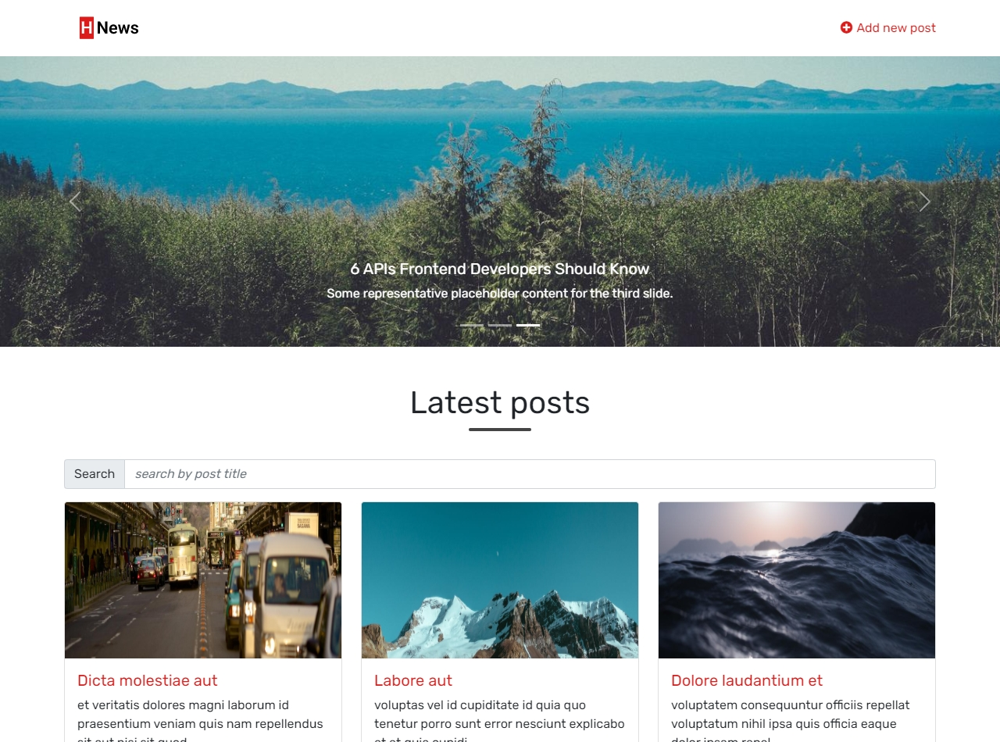

# HNews Project 📰

Hello


## Introduction

News simple website contains three pages:

- Home page: `/`
- Add/Edit a post page: `/add-edit-post.html`
- Post detail page: `/post-detail.html`

## Technology

- [ViteJS](https://vitejs.dev/)
- [Boostrap](https://getbootstrap.com/): Used for building responsive layout
- [Bootstrap Carousel](https://getbootstrap.com/docs/4.0/components/carousel/): Used for slide show on Home page
- [Fetch](https://github.com/github/fetch): Used for working with API
- [Axios](https://github.com/axios/axios): Used for working with API

## Setup Environment

```
# npm 6.x
npm init vite@latest js-post-ui --template vanilla

# npm 7+, extra double-dash is needed:
npm init vite@latest js-post-ui -- --template vanilla

# yarn
yarn create vite js-post-ui --template vanilla
```

> src : https://vitejs.dev/guide/#scaffolding-your-first-vite-project

## Folder Structure

```
root
|__ dist                # output folder when running build
|__ images              # all images should be here
|__ js                  # js files
| |__ api
| |__ constants
| |__ utils
| |__ ...
|
|__ node_modules        # all deps used by our project
|__ public              # files to be copied to dist folder
|__ styles              # css files
|__ index.html          # home page (default entry point)
|__ package.json        # package info
|__ vite.config.js      # custom config of vitejs
|__ yarn.lock           # generated by yarn
```

## Setup Multi-Page for ViteJS

By default, it only compile the index.html file. In case you want multi-page support, you need to customize `vite.config.js`

```js
const { resolve } = require('path')
const { defineConfig } = require('vite')

module.exports = defineConfig({
  build: {
    rollupOptions: {
      input: {
        main: resolve(__dirname, 'index.html'),
        postDetail: resolve(__dirname, 'post-detail.html'),
        addEditPost: resolve(__dirname, 'add-edit-post.html'),
      },
    },
  },
})
```

> src : https://vitejs.dev/guide/build.html#multi-page-app

## Post API Guide

- API_URL: `https://js-post-api.herokuapp.com/api`

### Get a list of posts

```sh
GET /posts
```

Supported query params:

- `_limit`: Limit the number of items per page.
- `_page`: Current page.
- `_sort`: Indicate which field should be sorted on
- `_order`: Indicate sort direction.

_Eg: Get page 2 posts with 10 posts/page_

```sh
GET /posts/:postId?_limit=10&_page=2
```

_Eg: Sort post to get the latest posts first._

```sh
GET /posts/:postId?_sort=updatedAt&_order=desc
```

### To get a post detail

```sh
GET /posts/:postId
```

### To add a new post

```sh
POST /posts
```

Sample payload:

```js
{
  title: 'New title',
  author: 'Hin Tran',
  description: 'New description',
  imageUrl: 'https://picsum.photos/id/580/1368/400',
}
```

### To update a post

```sh
PATCH /posts/:postId
```

Please ONLY include changes to your payload:

```js
{
  id: 'your-post-id',
  title: 'My new title',
}
```

### To remove a post

```sh
DELETE /posts/:postId
```

## :house: Home page

### Render list of posts

- Research `Bootstrap Carousel` and add to home page
  - Include 3 slides
  - Each slide has title and description
  - Auto move the next slide
- Fetch list of posts and render to UI
- Sort list of post to show the latest post first
- `ADVANCED`: Support pagination to be able to to fetch posts by page and limit the number of posts per page

### Handle event on each post item

- `Click`: Go to detail page and show detail of clicked post
- `Edit button click`: Go to edit page and populate detail of clicked post to form
- `Remove button click`: Show confirmation to remove? If yes, remove it. Otherwise, do nothing

## Add/Edit post page

- Add form validation
  - Require `title` field
  - Require `author` field

**ADD MODE** (if `postId` query param doesn't exist)

- Handle form submit
  - Show error if validation is failed. Stop form submit
  - Add new post with submitted values: `title`, `author`, `description` and `imageUrl`
  - If add successfully, show an alert with message `Save post successfully` and redirect to Edit page of the new post
  - If failed, show an alert with error message

**EDIT MODE** (if `postId` query param exists)

- Get post detail and set initial value for form
- Handle form submit
  - Do nothing if user doesn't change anything
  - Show error if validation is failed. Stop form submit
  - Update existing post with field that has changes. Don't include unchanged properties inside payload
  - If update successfully, show an alert with message `Save post successfully`
  - If failed, show an alert with error message

## Post detail page

- Get post detail.
- Update corresponding DOM: `title`, `description`, `author`, `createdAt` and `imageUrl`
- Integrate with `Lightbox` to view image when click on image
